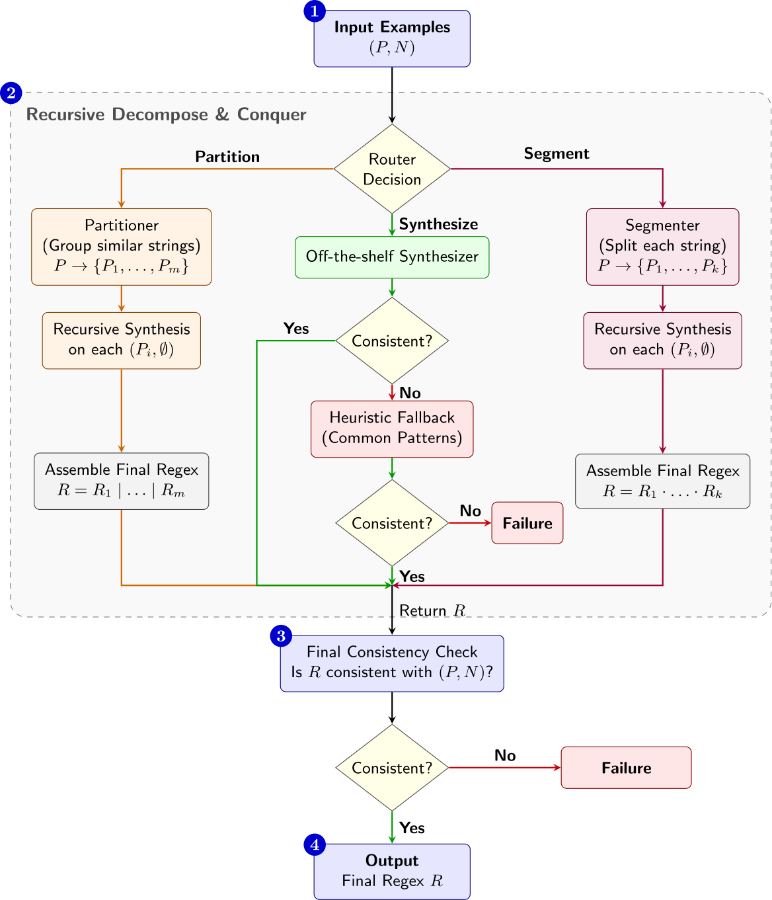
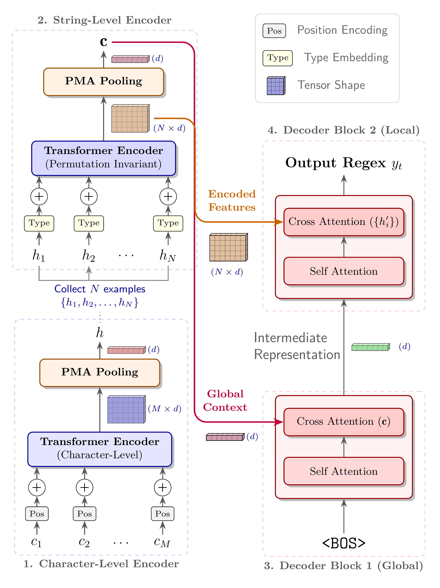

# ReSyn

[](https://arxiv.org/abs/2603.24624)
[](https://huggingface.co/papers/2603.24624)
[](https://huggingface.co/datasets/mrseongminkim/ReSyn)
[](https://huggingface.co/models?search=mrseongminkim/ReSyn)
[](https://wandb.ai/mrseongminkim-university-of-seoul/ReSyn)

This repository contains the official implementation of **ReSyn: A Generalized Recursive Regular Expression Synthesis Framework** (accepted in IJCAI 2026).

## Overview

Existing neural sequence-to-sequence synthesizers struggle with the structural complexity of real-world regular expressions, particularly those with deep nesting and frequent Union operations. **ReSyn** is a generalized recursive divide-and-conquer framework designed to overcome these limitations. It decomposes complex synthesis problems into manageable sub-problems by adaptively predicting whether to split examples sequentially (Concatenation) or group them by structural similarity (Union).

<p align="center">
  
  <br>
  <em>An illustration of how complex synthesis problems are recursively decomposed and reconstructed.</em>
</p>

<p align="center">
  
  <br>
  <em>The overall recursive decompose-and-conquer pipeline of ReSyn.</em>
</p>

### Framework Components

The ReSyn framework consists of four core neural modules:
- **`SET2REGEX`**: A parameter-efficient (10M) base synthesizer equipped with a Hierarchical Set Encoder to capture the permutation invariance of examples.
- **`ROUTER`**: A policy network that dynamically determines the optimal decomposition strategy (Segmentation, Partitioning, or Synthesis) based on structural patterns.
- **`PARTITIONER`**: A clustering module that divides a set of examples into disjoint subsets (handling Union operations).
- **`SEGMENTER`**: A sequence labeling module that determines optimal split points within strings (handling Concatenation operations).

<p align="center">
  
  <br>
  <em>The architecture of the SET2REGEX base synthesizer.</em>
</p>

## Getting Started

### Cloning the Repository

This codebase relies on the [FOREST](https://github.com/mrseongminkim/FOREST) repository as a submodule. Therefore, you must clone the repository recursively:

```bash
git clone --recursive https://github.com/mrseongminkim/ReSyn.git
```

If you have already cloned the repository without the `--recursive` flag, you can initialize and update the submodule by running:

```bash
git submodule update --init --recursive
```

### Installation

After cloning the repository, install the required dependencies:

```bash
pip install -r requirements.txt
```

## Datasets

You can generate the datasets manually using the provided script:

```bash
python -m data.generate_datasets
```

For your convenience, the pre-generated datasets are hosted on Hugging Face: [mrseongminkim/ReSyn](https://huggingface.co/datasets/mrseongminkim/ReSyn). 
During training or evaluation, the dataset will be automatically downloaded from Hugging Face if it is not found locally.

## Training

The framework requires training a total of five models. 

### Training ReSyn Components

The four core ReSyn components can be trained using the following commands:

```bash
python -m ReSyn.trainer --model partitioner --gpu 0
python -m ReSyn.trainer --model router --gpu 1
python -m ReSyn.trainer --model set2regex --gpu 2
python -m ReSyn.trainer --model segmenter
```

### Training the Baseline (Prax)

To train the Prax baseline model, run:

```bash
python -m baselines.prax
```

## Pre-trained Models & Logs

We provide pre-trained models and complete training logs to facilitate reproducibility:

1. **Training Logs:** All training logs and metrics can be accessed via [Weights & Biases (W&B)](https://wandb.ai/mrseongminkim-university-of-seoul/ReSyn).
2. **Prax Model:** The pre-trained Prax model is available on Hugging Face: [mrseongminkim/ReSyn-byt5-small](https://huggingface.co/mrseongminkim/ReSyn-byt5-small).
3. **ReSyn Components:** The four component checkpoints are hosted as individual model repositories on Hugging Face (and, being small in size, are also included in this repository for convenience):
   - [mrseongminkim/ReSyn-Set2Regex](https://huggingface.co/mrseongminkim/ReSyn-Set2Regex)
   - [mrseongminkim/ReSyn-Router](https://huggingface.co/mrseongminkim/ReSyn-Router)
   - [mrseongminkim/ReSyn-Partitioner](https://huggingface.co/mrseongminkim/ReSyn-Partitioner)
   - [mrseongminkim/ReSyn-Segmenter](https://huggingface.co/mrseongminkim/ReSyn-Segmenter)

   At inference time, each component loads from the local `checkpoints/` directory if available; otherwise it is automatically downloaded from the Hub. You can also load any component directly via [`PyTorchModelHubMixin`](https://huggingface.co/docs/huggingface_hub/package_reference/mixins#huggingface_hub.PyTorchModelHubMixin):

   ```python
   from ReSyn.model import Set2Regex

   model = Set2Regex.from_pretrained("mrseongminkim/ReSyn-Set2Regex")
   ```

## Citation

If you find this repository useful in your research, please consider citing our paper:

```bibtex
@inproceedings{kim2026resyn,
  title={ReSyn: A Generalized Recursive Regular Expression Synthesis Framework},
  author={Kim, Seongmin and Cheon, Hyunjoon and Kim, Su-Hyeon and Han, Yo-Sub and Ko, Sang-Ki},
  booktitle={Proceedings of the Thirty-Fifth International Joint Conference on Artificial Intelligence (IJCAI-26)},
  year={2026}
}
```
